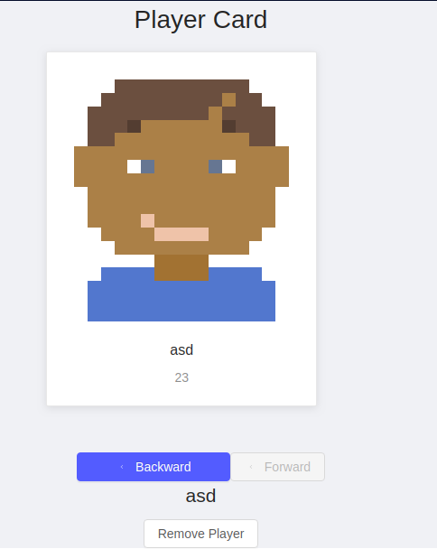
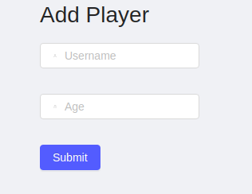

#### This small project is minesweeper game
** The fist tab is where you can see the players 
  
** The second tab is where you can add players (but they will be removed when you refresh -No database-) 
  

** In the third tab there is a radar chart to visualize the survey of the game

** In the forth tab the game itself
