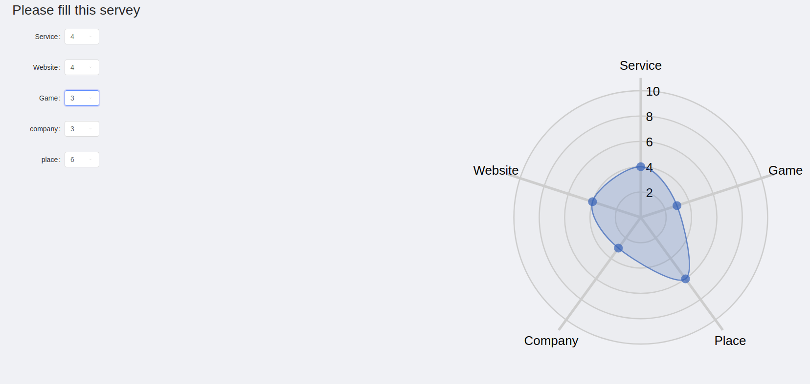
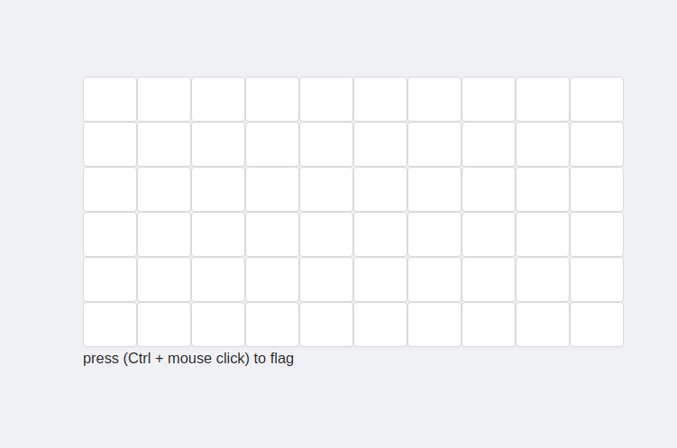
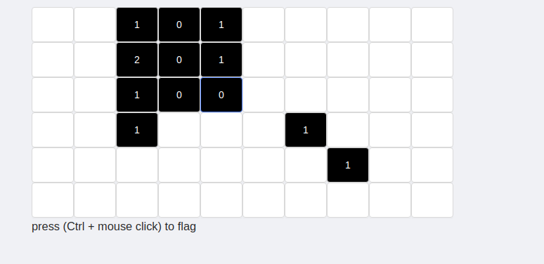
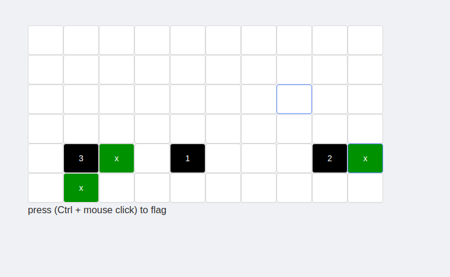

<h1> This small project is minesweeper game</h1>
<h3>** The fist tab is where you can see the players</h3> 
  
<h3>** The second tab is where you can add players (but they will be removed when you refresh -No database-) </h3>
  

<h3>** In the third tab there is a radar chart to visualize the survey of the game</h3>
  

<h3>** In the forth tab the game itself</h3>
  
  
  

